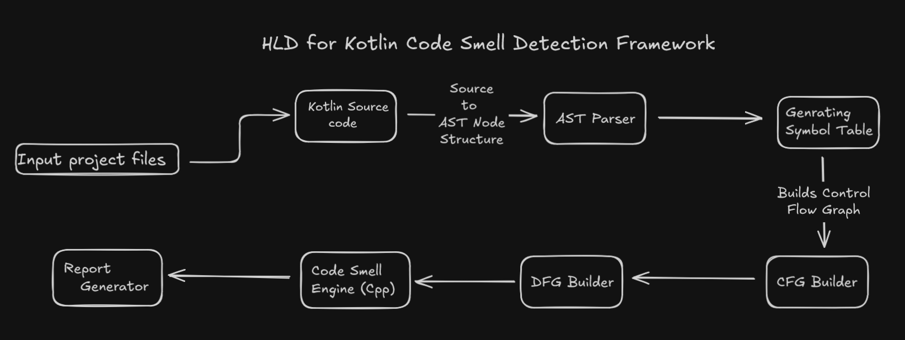

# Code Smell Detection Framework

This project is a **C++ framework** for detecting **code smells** in **Kotlin applications**.  
It leverages **Tree-sitter** to parse Kotlin source code into an **AST (Abstract Syntax Tree)** and then performs multiple layers of analysis — including **Symbol Table** ,  **Control Flow Graph (CFG)** and **Data Flow Graph (CFG)** — to identify performance-related smells like **memory leaks**, **CPU overuse**, **resource mismanagement** and **Network Related**.

## Overview

## Step-by-Step Design

### **1 .Tree-Sitter Parser**
- **Goal:** To Generate the Abstract Syntax Tree (AST) for Kotlin code.
**Implementation:**
  - Used [Tree-sitter](https://tree-sitter.github.io/tree-sitter/) with the Kotlin grammar.
  - Parse source files and export the tree as a JSON expression.
- **Output:** A structured AST file representing Kotlin syntax.

### **2️ .AST Builder**
- **Goal:** Convert the Tree-sitter JSON output into C++ objects.
- **Responsibilities:**
  - Create a hierarchical tree of ASTNode objects.
  - Provide traversal and query utilities.

### **3.Symbol Table Builder**

- **Goal**: Capture all variable, function, and class declarations for semantic understanding.

- **Responsibilities**:

    - Track variable scopes and lifetimes.

    - Store function signatures and types.

    - Provide lookup support for identifiers.

- **Use Case**:

    - Needed for memory leak detection (track resource allocation and release).

### 4 . CFG (Control Flow Graph) Builder

- **Goal**: Model the flow of execution within the code.

- **Dependencies**: Uses information from the Symbol Table for accurate linking.

- **Responsibilities**:

    - Build nodes for statements, loops, and conditionals.

    - Establish directed edges to represent control flow.

- **Use Case:**

    - Detects infinite loops, unused branches, and CPU-heavy computations.

### 4 . DFG (Data Flow Graph) Builder

- **Goal**: Models how data flows in the program.

- **Dependencies**: AST (to know variable nodes) , Symbol Table (to know types / scopes) , CFG (to know execution sequence)

- **Responsibilities**:

    - Track how data moves between operations.

    - Build edges based on: Definitions (Def) and Uses (Use)

    - Identify:
        - Read-after-write (RAW)  ,       Write-after-write (WAW)  ,  Write-after-read (WAR)

- **Use Case:**

    - Memory Leak Detector

    - Allocation-in-Loop Detector

    - Unreleased Resource Detector

    - Heavy Object Reuse Detector

    - Uninitialized Variable Detector

## 5. Smell Detection Engine

- **Goal**: Apply rules and heuristics to detect potential code smells.

- **Responsibilities**:

    - Traverse the AST, Symbol Table, CFG and DFG.

    - Implement smell-specific rule classes:

    - MemoryLeakRule

    - HeavyLoopRule

    - UnreleasedResourceRule

- **Output**: A list of detected smells with location and severity.

## 6. Report Generator

- **Goal**: Summarize the detected code smells in a readable format.

- **Responsibilities**:

    - Export reports in JSON, CSV, or console format.

    - Integrate easily with dashboards or IDE plugins.