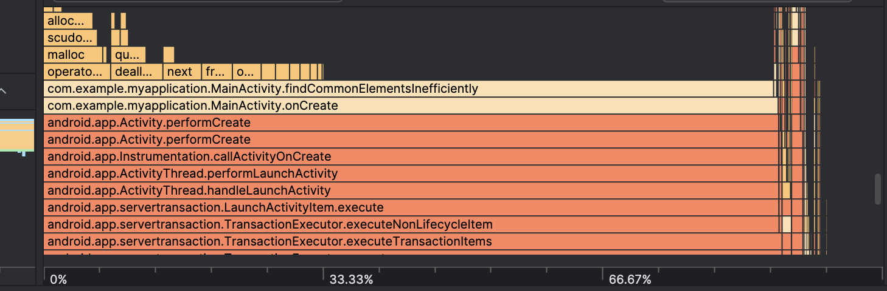
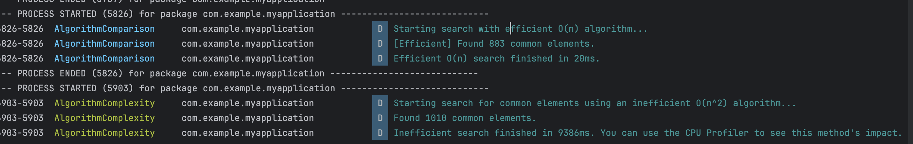

- Code Smell: Using an algorithm with poor time complexity (e.g., O(n²)) when a more efficient one (e.g., O(n log n) or O(n)) exists.

```java
class MainActivity : ComponentActivity() {

    override fun onCreate(savedInstanceState: Bundle?) {
        super.onCreate(savedInstanceState)

        // --- Inefficient Algorithm Example ---
        // Let's create two large lists of numbers.
        val listSize = 10000
        val list1 = List(listSize) { Random.nextInt(0, 100000) }
        val list2 = List(listSize) { Random.nextInt(0, 100000) }

        Log.d("AlgorithmComplexity", "Starting search for common elements using an inefficient O(n^2) algorithm...")

        // Here we measure the time it takes to run the inefficient algorithm.
        // This operation is performed on the main thread and can cause UI freezes if it's too slow.
        val duration = measureTimeMillis {
            val commonElements = findCommonElementsInefficiently(list1, list2)
            Log.d("AlgorithmComplexity", "Found ${commonElements.size} common elements.")
        }

        Log.d("AlgorithmComplexity", "Inefficient search finished in ${duration}ms. You can use the CPU Profiler to see this method's impact.")
        // --- End of Example ---


        setContent {
            Box(modifier = Modifier.fillMaxSize(), contentAlignment = Alignment.Center) {
                Text("Check Logcat for performance metrics of the inefficient algorithm!")
            }
        }
    }

    /*
     A more efficient approach (O(n+m)) would be to add all elements of one list
     to a HashSet and then iterate through the second list to check for existence
     in the set.
     */
    private fun findCommonElementsInefficiently(list1: List<Int>, list2: List<Int>): List<Int> {
        val common = mutableListOf<Int>()
        for (item1 in list1) {
            for (item2 in list2) {
                if (item1 == item2) {
                    common.add(item1)
                }
            }
        }
        return common
    }w
}

```


