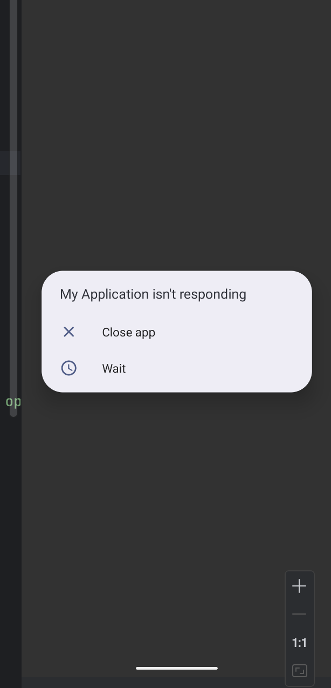

```java
class MainActivity : ComponentActivity() {

    override fun onCreate(savedInstanceState: Bundle?) {
        super.onCreate(savedInstanceState)

        setContent {
            var statusText by remember { mutableStateOf("Click the button to start.") }

            Column(
                modifier = Modifier.fillMaxSize(),
                verticalArrangement = Arrangement.Center,
                horizontalAlignment = Alignment.CenterHorizontally
            ) {
                Text(statusText, modifier = Modifier.padding(16.dp))

                Button(onClick = {
                    // --- CODE SMELL: Blocking the Main Thread ---
                    Log.d("MainThreadBlock", "Button clicked. Starting a 5-second blocking operation ON THE MAIN THREAD.")
                    statusText = "Work started... UI is now frozen!"

                    val duration = measureTimeMillis {
                        try {
                            // This is a classic example of blocking the main thread.
                            // While this is running, the UI cannot be redrawn, and the app
                            // cannot respond to any user input.
                            // In a real app, this might be a slow network request or database query.
                            Thread.sleep(5000) // Simulate a 5-second task.
                        } catch (e: InterruptedException) {
                            e.printStackTrace()
                        }
                    }

                    // This log and UI update will only happen AFTER the 5-second freeze.
                    Log.d("MainThreadBlock", "Blocking operation finished after ${duration}ms.")
                    statusText = "Task finished! The UI was frozen for 5 seconds."
                    // --- END OF SMELL ---
                }) {
                    Text("Start 5-Second Blocking Task")
                }
            }
        }
    }
}
```

- You are calling Thread.sleep(5000) directly inside the Button's onClick lambda. This lambda executes on the main UI thread.When you block the main thread for more than a few seconds.
- the Android operating system detects that your app is frozen and cannot respond to user input or even redraw its own UI. It then deliberately terminates your app and shows the "Application Not Responding" dialog. This is a protective measure to prevent apps from becoming permanently unresponsive.
 

- SOl
- Get a CoroutineScope using rememberCoroutineScope().2.Launch a new coroutine when the button is clicked.3.Use withContext(Dispatchers.IO) to move the Thread.sleep() operation safely to a background thread.