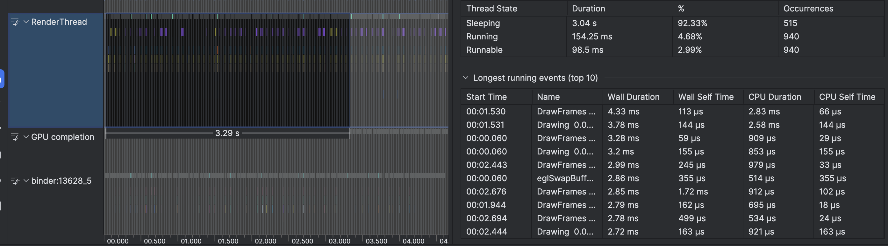

- The onDraw() method is called for every frame during rendering, so it must be extremely fast.
- Code Smell: Creating new Paint or Path objects inside onDraw().
- Performing complex calculations or file I/O within onDraw(). Allocating large bitmaps inside onDraw().

```java
class InefficientDrawingView @JvmOverloads constructor(
    context: Context,
    attrs: AttributeSet? = null,
    defStyleAttr: Int = 0
) : View(context, attrs, defStyleAttr) {

    private var frameCounter = 0

    // This Runnable will be used to continuously invalidate the view, forcing a redraw.
    private val animationRunnable = object : Runnable {
        override fun run() {
            invalidate() // Request a redraw. This will trigger onDraw().
            postDelayed(this, 16) // Aim for roughly 60 frames per second.
        }
    }

    fun startAnimation() {
        post(animationRunnable)
    }

    override fun onDraw(canvas: Canvas) {
        super.onDraw(canvas)

        // --- CODE SMELLS ---

        // 1. SMELL: Creating new objects inside onDraw().
        // Paint, Path, Rect, etc., should be created once as member properties and reused.
        // Creating them here allocates new memory on every single frame,
        // which triggers the Garbage Collector and causes severe performance issues.
        val paint = Paint().apply {
            color = Color.BLUE
            textSize = 50f
        }
        
        // This log will spam Logcat, proving onDraw is called frequently
        // and that we are creating a new Paint object every time.
        Log.d("OnDrawSmell", "onDraw frame ${frameCounter++}. New Paint() object created: $paint")

        // 2. SMELL: Performing calculations.
        // onDraw should only contain drawing commands. Any calculations to determine
        // what to draw (e.g., positions, sizes) should be done elsewhere and the
        // results cached in member properties.
        var complexResult = 0
        for (i in 0..200) { // Simulating a heavy calculation.
            complexResult += i
        }

        // --- END OF SMELLS ---

        // Drawing commands are fine, but here they rely on the objects and calculations
        // that were inefficiently performed above.
        canvas.drawText("This is an inefficient view!", 50f, 100f, paint)
        canvas.drawText("Calculation result: $complexResult", 50f, 200f, paint)
        canvas.drawLine(0f, height / 2f, width.toFloat(), height / 2f, paint)
    }
}

```



- Cure
1. Initializes Paint objects only once as member properties, so they are not recreated on every frame.
2. Moves all calculations out of onDraw(). The complexResult will be calculated once and stored.
3. Keeps the onDraw() method lean and fast, containing only essential drawing commands.
