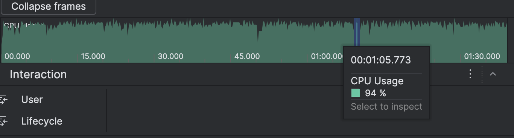
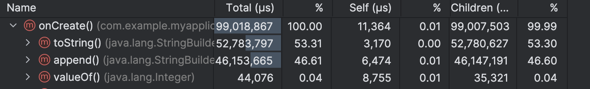

- Code Smell : Instantiating objects (new MyObject()) inside loops that run thousands of times.
- String concatenation using + inside a loop. Use StringBuilder instead.
- Autoboxing primitives (e.g., assigning an int to an Integer) inside performance-critical loops.
```java
class MainActivity : ComponentActivity() {

    // A simple data class for our example.
    data class Point(val x: Int, val y: Int)

    override fun onCreate(savedInstanceState: Bundle?) {
        super.onCreate(savedInstanceState)

        // --- Excessive Object Allocation Example ---
        val iterations = 200_000
        var logMessage = ""
        val list = mutableListOf<Integer>() // Using Java's Integer to make autoboxing clearer

        Log.d("ObjectAllocation", "Starting loop with excessive object allocation...")

        val duration = measureTimeMillis {
            for (i in 0 until iterations) {
                // 1. SMELL: Instantiating a new object in every loop iteration.
                // This creates hundreds of thousands of Point objects.
                val point = Point(i, i + 1)

                // 2. SMELL: String concatenation with '+' in a loop.
                // This implicitly creates a new StringBuilder and String object on each iteration.
                // A single, explicit StringBuilder outside the loop is far more efficient.
                logMessage += "Processed point: ${point.x}, "

                // 3. SMELL: Autoboxing a primitive.
                // The primitive 'i' (int) is converted to an 'Integer' object before being added to the list.
                // This creates an unnecessary wrapper object for each item.
                list.add(i as Integer) 
            }
        }

        Log.d("ObjectAllocation", "Loop finished in ${duration}ms. It created ${iterations * 3} or more temporary objects.")
        // --- End of Example ---

        setContent {
            Box(modifier = Modifier.fillMaxSize(), contentAlignment = Alignment.Center) {
                Text("Check Logcat to see the impact of object allocation!")
            }
        }
    }
}

```


```md
aiting for a blocking GC Alloc
2025-10-30 00:21:20.114  6957-6957  e.myapplication         com.example.myapplication            I  WaitForGcToComplete blocked Alloc on Background for 9.001ms
2025-10-30 00:21:20.168  6957-6957  e.myapplication         com.example.myapplication            I  Waiting for a blocking GC Alloc
2025-10-30 00:21:20.178  6957-6957  e.myapplication         com.example.myapplication            I  WaitForGcToComplete blocked Alloc on Background for 9.314ms
2025-10-30 00:21:20.231  6957-6957  e.myapplication         com.example.myapplication            I  Waiting for a blocking GC Alloc
```
- here the applicationi sblocking due to lack of memeiry , so the application haulted till the gc frees memeory and then it allocates and this process repeats