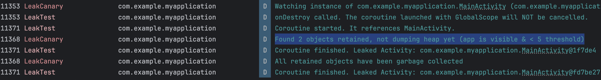

```java
class MainActivity : ComponentActivity() {

    override fun onCreate(savedInstanceState: Bundle?) {
        super.onCreate(savedInstanceState)
        setContent {
            Text("Rotating this screen will cause a memory leak.")
        }

        // We launch a coroutine in the GlobalScope. This scope lives as long as the application.
        // The lambda passed to launch captures a reference to MainActivity.
        GlobalScope.launch {
            Log.d("LeakTest", "Coroutine started. It references MainActivity.")

            // Delay for 20 seconds to simulate a long task.
            delay(20000)

            // This line uses the activity context, ensuring the reference is held.
            Log.d("LeakTest", "Coroutine finished. Leaked context: ${this@MainActivity.applicationContext}")
        }
    }

    override fun onDestroy() {
        super.onDestroy()
        Log.d("LeakTest", "onDestroy called. If the coroutine is still running, a leak will occur.")
    }
}

```


- it is debug statemnet of leakcanary, when a abackgrond processs like this coriutine leaks something, leakcanay will not declare it as lwak, it waits for 5 leaks and as there are only 2 leaks, the corutine will continue without leakinh.

- Here there is a thread running for long time, than the main activity, declaring it in the scope of the main activity there will be no leak as the therad destrpys on closing the activity.
- The coroutine is securely bound to the Activity's lifecycle via lifecycleScope.
- On global scope launch the thread stays live for whole applcaiotn, not just the main activity.
- Trigger: This action triggers the system to destroy and recreate the Activity.
- Scope is Cancelled -> Automatic Cleanup: automatically call cancel() on the associated CoroutineScope.
- But wil get if it is tied to global scope, because on destroying the activity the thread running must get destroyed, but as it is referencing the global it wont get destroyed.
- It is like creating a  process that references the mainactiivty, but when delted the main should delete as the demon is running it memeory leaks.
# Solution

```java
class MainActivity : ComponentActivity() {

    override fun onCreate(savedInstanceState: Bundle?) {
        super.onCreate(savedInstanceState)
        setContent {
            Text("Rotating this screen will cause a memory leak.")
        }

        // We launch a coroutine in the lifecycleScope. This scope is tied to the Activity's lifecycle.
        // The coroutine will be automatically canceled when the Activity is destroyed.
        lifecycleScope.launch {
            Log.d("LeakTest", "Coroutine started. It references MainActivity.")

            // Delay for 20 seconds to simulate a long task.
            delay(20000)

            // This line uses the activity context, but it won't cause a leak because the scope is managed.
            Log.d("LeakTest", "Coroutine finished. Context: ${this@MainActivity.applicationContext}")
        }
    }

    override fun onDestroy() {
        super.onDestroy()
        Log.d("LeakTest", "onDestroy called. The coroutine launched with lifecycleScope will be cancelled.")
    }
}

```
- As we are tying the couroutine to lifecycle launch the coruotine will get destroyed on main activity deletion.

# Inner class
```java
class MainActivity : ComponentActivity() {

    /**
     * This is a non-static inner class. In Kotlin, the `inner` keyword makes it so.
     * It holds an implicit reference to the outer MainActivity instance.
     */
     // remove inner willl ake it static
    inner class LongRunningTask : Runnable {
        override fun run() {
            Log.d("LeakTest", "Inner class task started.")
            // This thread will sleep for 20 seconds, outliving the Activity on rotation.
            Thread.sleep(20000)

            // Accessing the outer class instance here keeps the reference alive,
            // preventing the destroyed MainActivity from being garbage collected.
            Log.d("LeakTest", "Inner class task finished. Leaked Activity: ${this@MainActivity}")
        }
    }

    override fun onCreate(savedInstanceState: Bundle?) {
        super.onCreate(savedInstanceState)
        setContent {
            Text("Rotating this screen will cause a memory leak.")
        }

        // We start a new thread that is not managed by the Activity's lifecycle.
        // This thread runs an instance of our inner class, which holds a reference
        // to this MainActivity, causing a leak on configuration change.
        Thread(LongRunningTask()).start()
    }

    override fun onDestroy() {
        super.onDestroy()
        Log.d("LeakTest", "onDestroy called. The Thread will NOT be cancelled.")
    }
}
```
- The inner class will have implict reference to the outer class. So when main activity is deleted, the gc wont collet these , as the routine is referncing.
- By declaring it as static will not cause this leak.