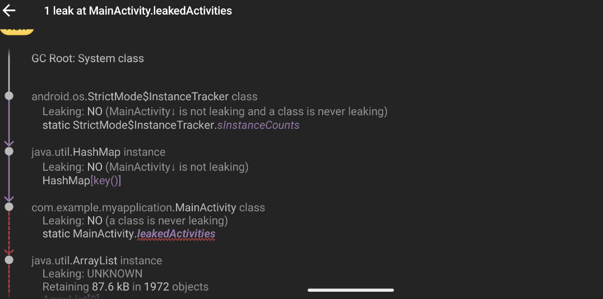
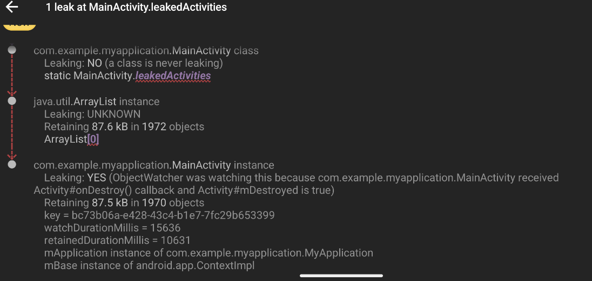

```java
class MainActivity : ComponentActivity() {

    companion object {
        // Leak #1: Holding a reference to every activity instance created on rotation.
        val leakedActivities = mutableListOf<MainActivity>()

        var leakedView: View? = null
    }

    override fun onCreate(savedInstanceState: Bundle?) {
        super.onCreate(savedInstanceState)
        setContent {
            Column(
                modifier = Modifier.fillMaxSize(),
                horizontalAlignment = Alignment.CenterHorizontally
            ) {
                Button(onClick = {
                    //logcat
                    Log.d("LeakTest", "Current number of leaked activities: ${leakedActivities.size}")
                    Log.d("LeakTest", "Leaked view is a: ${leakedView?.javaClass?.simpleName}")
                }) {
                    Text("Log Leaked Info")
                }

                // The AndroidView composable embeds a classic Android View inside a Compose UI.
                AndroidView(
                    factory = { context ->
                        // Create a traditional TextView.
                        TextView(context).apply {
                            text = "This classic TextView will be leaked."
                            // Assign this new View instance to our static variable, creating Leak #2.
                            leakedView = this
                            Log.d("LeakTest", "TextView created and assigned to static reference.")
                        }
                    }
                )
            }
        }

        // Add the current activity instance to the static list (Leak #1).
        leakedActivities.add(this)
        Log.d("LeakTest", "MainActivity created. Total instances in list: ${leakedActivities.size}")
    }

    override fun onDestroy() {
        super.onDestroy()
        Log.d("LeakTest", "MainActivity onDestroy() called. Instance and View both remain in memory.")
    }
}

```
## Leak #1: Static List of Activities

This leak is caused by adding every `MainActivity` instance to a static `MutableList` on creation. Since the static list is never cleared, 
it holds a reference to every activity created during screen rotations, preventing them from being garbage collected.

## Leak #2: Static Reference to a View

This leak is caused by assigning a `TextView` instance to a static `View` variable. Because the `View` holds a reference to the `Context` (the `Activity`) it was created in, holding onto the `View` implicitly holds onto the entire `Activity`.





# Solution 1 (NULLIFY those static refernce)

```java
override fun onDestroy() {
        super.onDestroy()
        leakedView = NULL
        Log.d("LeakTest", "MainActivity onDestroy() called. Instance and View both remain in memory.")
    }
```

# Solution 2
```java
companion object {
        // SOLUTION: Use WeakReference to hold references without preventing garbage collection.
        val activityInstances = mutableListOf<WeakReference<MainActivity>>()
        var viewInstance: WeakReference<View>? = null
}
```
- This deletes the activity on destrying th activity.

### Bitmaps
- Bitmaps are used whenever you want to draw images on the screen, manipulate images, or perform graphics operations.
- A Bitmap is essentially a map of pixels — it represents an image in memory.
- Their size os too large.