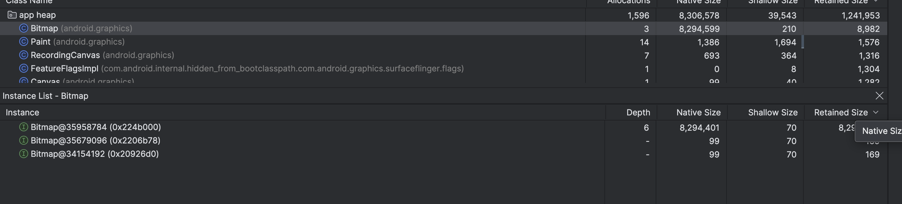

```java
class MainActivity : ComponentActivity() {

    // Use a mutableStateOf to hold the bitmap. Compose will automatically
    // update the UI when this state changes.
    private val bitmapState = mutableStateOf<Bitmap?>(null)

    override fun onCreate(savedInstanceState: Bundle?) {
        super.onCreate(savedInstanceState)

        Log.d("MemoryTest", "onCreate called.")

        // The bitmap creation is now moved to a background thread to prevent blocking the UI.
        if (bitmapState.value == null) {
            lifecycleScope.launch(Dispatchers.IO) {
                Log.d("MemoryTest", "Starting to create large bitmap in background...")
                val bitmap = Bitmap.createBitmap(1920, 1080, Bitmap.Config.ARGB_8888)
                // Post the result back to the main thread by updating the state.
                bitmapState.value = bitmap
                Log.d("MemoryTest", "Bitmap created and set.")
            }
        }

        setContent {
            val currentBitmap = bitmapState.value
            Box(modifier = Modifier.fillMaxSize(), contentAlignment = Alignment.Center) {
                if (currentBitmap != null) {
                    // If the bitmap is ready, display it.
                    Image(
                        bitmap = currentBitmap.asImageBitmap(),
                        contentDescription = "A large bitmap",
                        modifier = Modifier.fillMaxSize()
                    )
                } else {
                    // If the bitmap is not ready, show a loading indicator.
                    CircularProgressIndicator()
                }
            }
        }
    }

    override fun onTrimMemory(level: Int) {
        super.onTrimMemory(level)
        Log.d("MemoryTest", "onTrimMemory called with level: $level")
        if (level == ComponentCallbacks2.TRIM_MEMORY_UI_HIDDEN) {
            Log.d("MemoryTest", "UI is hidden. Releasing bitmap to save memory.")
            // When the UI is hidden, we release the bitmap to free up memory.
            bitmapState.value?.recycle()
            bitmapState.value = null
        }
    }

    override fun onDestroy() {
        super.onDestroy()
        bitmapState.value?.recycle()
        bitmapState.value = null
        Log.d("MemoryTest", "onDestroy called and bitmap released.")
    }
}
```

```java


class MainActivity : ComponentActivity() {

    // Get a reference to the ViewModel. The same ViewModel instance will survive rotations.
    private val viewModel: BitmapViewModel by viewModels()

    override fun onCreate(savedInstanceState: Bundle?) {
        super.onCreate(savedInstanceState)

        setContent {
            // The UI now simply observes the state from the ViewModel.
            val currentBitmap = viewModel.bitmapState.value

            Box(modifier = Modifier.fillMaxSize(), contentAlignment = Alignment.Center) {
                if (currentBitmap != null) {
                    // If the bitmap is ready, display it.
                    Image(
                        bitmap = currentBitmap.asImageBitmap(),
                        contentDescription = "A large bitmap that survives rotation",
                        modifier = Modifier.fillMaxSize()
                    )
                } else {
                    // If the bitmap is not ready, show a loading indicator.
                    CircularProgressIndicator()
                }
            }
        }
    }
    // No need for onTrimMemory or onDestroy to manage the bitmap anymore.
    // The ViewModel's onCleared() method handles the final cleanup.
}

```


- Native Memory (8.3 MB): This is the warehouse itself and all the goods inside it. It's huge and takes up a lot of space/ heap.
- Shallow Size: This is the single key to the warehouse. The key is tiny and fits in your pocket.
- Retained Size (191 KB): This is the key, plus the file folder in your office that contains the deed and inventory list for the warehouse.



- Here when the main activity is destroyed , the bitmap must be destroyed, but it is not happeneing, and those instanceses are alive throught the appication causig a leeak.
- And it is happeniing due to the background process is running for creating the bitmap, and before completion of that process, the mainactivuty is destroyed causing the leak.

- So we use View Model
- In Android, you must never modify UI state from a background thread. UI updates must always happen on the main UI thread.
- 1.The CircularProgressIndicator never went away because the UI state never officially changed to show the Image.
2. This likely caused an internal crash or loop within the Compose framework, leading to the app restarting and creating a new ViewModel and a new Bitmap over and over, which is why your heap was continuously increasing.
- By using withContext(Dispatchers.IO), we perform only the slow, heavy operation on a background thread. The code then automatically returns to the main thread, allowing bitmapState.value = bitmap to run safely. This allows the UI to update correctly, fixing the infinite loading screen and the continuously growing heap.