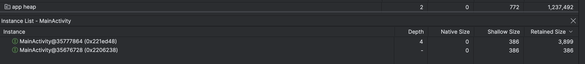

```java
class MainActivity : ComponentActivity() {

    override fun onCreate(savedInstanceState: Bundle?) {
        super.onCreate(savedInstanceState)

        // Initialize the singleton with the Activity context, causing a leak.
        // The singleton will hold this context for the lifetime of the app,
        // preventing the Activity from being garbage collected.
        LeakySingleton.initialize(this)

        setContent {
            Box(modifier = Modifier.fillMaxSize(), contentAlignment = Alignment.Center) {
                Text("This screen is leaking!")
            }
        }
    }
}
```
- The lifecyce of the leakysingleton object is global, and stays throught applicaiton, and when main activityo sdestroyed it will refernce tothe globa object causing theleaak.
- The instances of mianactivity will keep i=on increasing



```
// After (fixed):
LeakySingleton.initialize(this.applicationContext)
```
- By passing this.applicationContext instead of just this, we give the singleton a Context that is tied to the entire application's lifecycle, not just the Activity's. Since both the singleton and the application context live for the same amount of time, there is no leak.
- The problem before was that the singleton (long lifecycle) was holding onto the Activity (short lifecycle), preventing the Activity from being garbage collected after it was destroyed. Now, it's holding onto an object that lives just as long as it does, which is perfectly fine