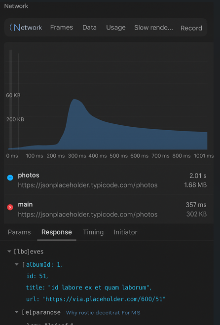

# Using uncompressed data (GZip)

## Problem
The application sends or receives large data over the network without compression (GZIP).
This increases network bandwidth usage, response time, and energy consumption, especially on mobile networks.

## Code Smell


**File**: MainActivity.kt

**Location**: app/src/main/java/com/example/networkondemo/MainActivity.kt


```
package com.example.networkondemo

import androidx.appcompat.app.AppCompatActivity
import android.os.Bundle
import android.util.Log
import okhttp3.OkHttpClient
import okhttp3.Request
import java.io.IOException

class MainActivity : AppCompatActivity() {
    override fun onCreate(savedInstanceState: Bundle?) {
        super.onCreate(savedInstanceState)

        // Network call made without enabling compression
        val client = OkHttpClient()
        val request = Request.Builder()
            .url("https://jsonplaceholder.typicode.com/photos") // Large JSON data
            .build()

        Thread {
            try {
                val response = client.newCall(request).execute()
                val responseData = response.body?.string()
                Log.d("NetworkData", "Data Size: ${responseData?.length}")
            } catch (e: IOException) {
                e.printStackTrace()
            }
        }.start()
    }
}

```

The request does not specify Accept-Encoding: gzip, so data is transferred uncompressed.

This can cause:

1. Increased data usage

2. Slow responses

3. High battery consumption

4. Unnecessary load on servers



## Modified Code

```
package com.example.networkondemo

import androidx.appcompat.app.AppCompatActivity
import android.os.Bundle
import android.util.Log
import okhttp3.OkHttpClient
import okhttp3.Request
import java.io.IOException
import java.util.zip.GZIPInputStream
import java.io.InputStreamReader
import java.io.BufferedReader

class MainActivity : AppCompatActivity() {
    override fun onCreate(savedInstanceState: Bundle?) {
        super.onCreate(savedInstanceState)

        // Enable GZIP compression
        val client = OkHttpClient()
        val request = Request.Builder()
            .url("https://jsonplaceholder.typicode.com/photos")
            .addHeader("Accept-Encoding", "gzip")
            .build()

        Thread {
            try {
                val response = client.newCall(request).execute()
                val body = response.body

                // If server responded with gzip data, decompress
                val encoding = response.header("Content-Encoding")
                val responseData = if (encoding != null && encoding.contains("gzip")) {
                    val gzipInputStream = GZIPInputStream(body?.byteStream())
                    val reader = BufferedReader(InputStreamReader(gzipInputStream))
                    reader.readText()
                } else {
                    body?.string()
                }

                Log.d("NetworkData", "Decompressed Data Size: ${responseData?.length}")
            } catch (e: IOException) {
                e.printStackTrace()
            }
        }.start()
    }
}

```

| Scenario       | Data Size (approx) | Behavior                                |
| -------------- | ------------------ | --------------------------------------- |
| Without GZIP | ~1.5 MB            | Takes longer to load, higher data usage |
| With GZIP    | ~300 KB            | Faster response, less network usage     |
